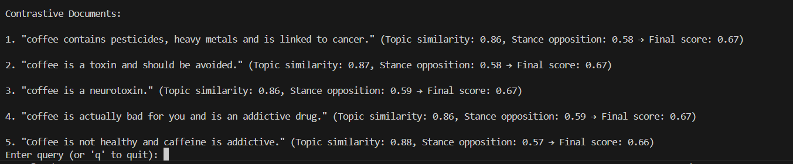

# Contrastive Ideas Search Module

**Description:**  
This module identifies documents or strings with **semantically opposing ideas** (e.g., "AI improves healthcare" vs. "AI harms healthcare"), not just dissimilar content. It combines **topic relevance** and **stance opposition detection** using a hybrid embedding strategy. The module leverages a vector database and advanced NLP techniques to ensure retrieved documents are both topically related and semantically conflicting.

---

### **Key Features & Requirements:**

#### **1. Hybrid Embedding Strategy**
   - **Topic Embedding**:  
     Uses a standard embedding model (e.g., `mxbai-embed-large`) to ensure retrieved documents share the **same topic** as the input.
   - **Stance Embedding**:  
     Uses **fine-tuned LLaMA 3 model** [`Samhita-kolluri/llama-contrastive-module-stance`](https://huggingface.co/Samhita-kolluri/llama-contrastive-module-stance) to detect **semantic opposition** ( trained on contradiction datasets SNLI ).

#### **2. Two-Phase Search Pipeline**
   - **Topic Filtering**:  
      Retrieve documents with high topic similarity to narrow down candidates.
   - **Stance Analysis**:  
      Rank filtered documents by their stance opposition score.

#### **3. Contrastive Scoring**
   - **Final Score**:  
     `final_score = (topic_similarity) * (1 + stance_opposition)`  
     Prioritizes documents that are both topically related and semantically opposed.
   - **Stance Opposition**:  
     Computed via dot product of stance embeddings, inverted to maximize contrast.

#### **4. Vector Database Schema**
   - **Database**: 
   Chroma DB or Pinecone with support for multi-vector indexing.
   
      ```python
      class Document:
       id: str
       text: str
       topic_embedding: List[float]  # For topic matching
       stance_embedding: List[float]  # For opposition detection
       metadata: Dict  # Source, timestamp, etc.
       ```

#### **5. Training Requirements**
   - **Stance Model**:  
     Fine-tune using triplet loss on contradiction datasets:
     ```python
     from sentence_transformers import SentenceTransformer, losses
     model = SentenceTransformer("mxbai-embed-large")
     loss = losses.ContrastiveLoss(model)  # Anchor vs. Positive (contrast) pairs
     ```
   - **Training Data**:  
     Use labeled contradiction pairs (e.g., ["Coffee is healthy", "Coffee is unhealthy"]).

#### **6. Edge Case Handling**
   - **Unrelated Documents**: Discard candidates with low topic similarity (`topic_similarity < threshold`).
   - **Ambiguity**: Apply confidence thresholds (`stance_opposition > 0.5`) to filter weak contrasts.

---

### **Workflow**

1. **Input**  
   Provide a document or string to analyze (e.g., `"AI improves healthcare"`).

2. **Embedding Generation**  
   The system generates two embeddings:  
   - `topic_embedding`: Represents the main subject of the input.  
   - `stance_embedding`: Captures the perspective or opinion conveyed.

3. **Topic Filtering**  
   The system queries the vector database to retrieve the top **N** documents that have the highest `topic_similarity` to the input.

4. **Stance Analysis**  
   For each topic-filtered document:  
   - Compute `stance_opposition` to evaluate how semantically opposing its stance is to the input.  
   - Combine `topic_similarity` and `stance_opposition` into a `final_score`.  
   - Rank all results based on their contrastive score.
> See [`docs\finetune_stance.md`](docs/finetune_stance.md) for details.
5. **Output**  
   Return the top **k** documents that express the most contrastive ideas to the input.

> For a detailed architecture, see [`docs/system_design.md`](docs/system_design.md)

---
### **Example Use Case**

**Input**:  
"Renewable energy can fully replace fossil fuels by 2030."

**Output**:
1. "Renewable energy lacks the scalability to replace fossil fuels before 2050."  
   (Topic similarity: 0.85, Stance opposition: 0.92 → **Final score: 1.63**)
2. "Fossil fuels are irreplaceable due to energy density requirements."  
   (Topic similarity: 0.78, Stance opposition: 0.88 → **Final score: 1.49**)
3. "Nuclear energy is the only viable replacement for fossil fuels."  
   (Topic similarity: 0.65, Stance opposition: 0.45 → **Discarded: stance < 0.5**)
   
---
**Input**:
"Coffee is healthy"

**Output**:

