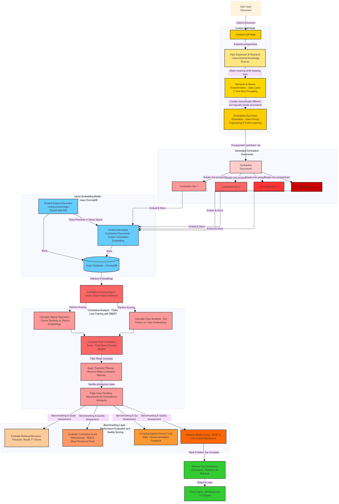

# System Design for Contrastive Ideas Search Module

## Overview
The **Contrastive Ideas Search Module** is designed to retrieve and rank documents that hold semantically opposing perspectives while maintaining topical relevance. The module leverages custom LLM processing, contrastive embeddings, and a hybrid retrieval strategy to ensure high-quality contrastive search.

---


## **1️⃣ System Components**
### **🧠 Custom LLM Node** (Contrastive Document Generation)
- Generates **four contrastive documents** per input using fine-tuned stance model.
- Uses **topic expansion, stance transformation, and structured prompting**.
- Ensures contrastive outputs are **topically similar yet semantically distinct**.

### **📦 Vector Embedding Model** (Storage & Retrieval)
- Dual embeddings:
  - **Topic Embedding** → Ensures documents are closely packed in the vector space.
  - **Stance Embedding** → Captures contrastive stance divergence.
- Stores embeddings in **ChromaDB** with **multi-vector indexing**.
- Enables hybrid retrieval for **optimized contrast ranking**.

### **📊 Contrastive Scoring Engine**
- **Computes topic similarity** using **dot product**.
- **Measures stance opposition** via **cosine similarity**.
- **Applies Triplet Loss** to improve contrastive learning.
- **Final Contrastive Score Calculation:**

  ```python
  final_score = (topic_similarity) * (1 + stance_opposition)
  ```

### **🎯 Benchmarking & Quality Evaluation**
- **Retrieval Accuracy Metrics:** Precision, Recall, and F1-score.
- **Ranking Effectiveness Metrics:** NDCG, MRR for ranking quality.
- **Adaptive Model Tuning:** RLHF-based optimization for refining retrieval.

### **📤 Output & API Layer**
- **REST API endpoint** for retrieving contrastive search results.
- **Structured JSON output** containing ranked contrastive documents.
- **Supports UI-based display** for document comparison.

---

## **2️⃣ Workflow**
### **1. Input Processing**
- Accepts **user-inputted documents**.
- The **Custom LLM Node** generates **four contrastive documents**.

### **2. Embedding & Storage**
- The original document and generated contrastive documents are **embedded**.
- Stores **Topic & Stance embeddings** in **ChromaDB**.

### **3. Contrastive Score Calculation**
- **Computes topic similarity** to ensure relevance.
- **Computes stance opposition** for meaningful contrast.
- **Final ranking score is calculated**.

### **4. Benchmarking & Model Tuning**
- Evaluates retrieval **accuracy and ranking quality**.
- Fine-tunes **stance-aware embeddings using RLHF**.

### **5. Output Generation**
- **Top contrastive documents are retrieved** and ranked.

---

## **3️⃣ Project Structure**
```bash
Contrastive-Ideas-Search-Module/
├── configs/
│   ├── config.yaml                   # General config thresholds, weights, settings)
│   ├── models.yaml                   # Model paths and settings
│   ├── db_config.yaml                # Vector DB configuration
├── data/
│   ├── contradiction_data.json       # Dataset for fine-tuning
├── docs/
│   ├── system_design.md              # System design, architecture
│   ├── sys-design.png                # System design diagram
│   ├── finetune_stance.md            # Notes on fine-tuning the stance model
├── src/
│   ├── main.py                      
│   ├── config.py                    
│   ├── llm/                          # LLM handling & prompt logic
│   │   ├── llm_handler.py            # Generates contrastive docs using LLM
│   │   ├── topic_expansion.py        # Topic expansion utilities
│   │   ├── stance_llm.py             # LLM-based stance analysis
│   │   ├── stance_transformation.py  # Logical stance inversions
│   │   ├── prompt_engineering.py     # Few-shot and dynamic prompt generation
│   ├── embeddings/                  
│   │   ├── vectorizer.py             # Hybrid vector embedding generator
│   │   ├── train_embeddings.py       # embedding model training
│   ├── database/
│   │   ├── vector_db.py              # ChromaDB interface
│   │   ├── store_embeddings.py       # Store generated vectors
│   │   ├── retrieve_embeddings.py    # Retrieve documents by vector query
│   ├── scoring/
│   │   ├── scoring.py                # Contrastive scoring logic
│   ├── benchmarking/
│   │   ├── retrieval_accuracy.py     # Precision/recall and eval on test sets
│   │   ├── contrastive_eval.py       # Custom contrastiveness evaluation
│   │   ├── rlhf_tuning.py            # Reinforcement Learning from Human Feedback
├── tests/
│   ├── test_llm.py
│   ├── test_embeddings.py
│   ├── test_vector_db.py
│   ├── test_scoring.py
│   ├── test_benchmarking.py
├── requirements.txt                # Python dependencies                      
├── README.md                       # Project overview
└── LICENSE
```
---
## Technologies Overview

| Component           | Technologies                                      |
|---------------------|---------------------------------------------------|
| **LLM Node**        | `meta-llama/Llama-3.2-3B-Instruct`, GPT-2, LLaMA 3, HuggingFace |
| **Dataset**        | [`Samhita-kolluri/snli-contrastive-json-dataset`](https://huggingface.co/datasets/Samhita-kolluri/snli-contrastive-json-dataset) |
| **Topic Embedding Model** | Sentence Transformers (`mixedbread-ai/mxbai-embed-large-v1`)|
| **Fine-Tuned Stance model** |  [`Samhita-kolluri/llama-contrastive-module-stance`](https://huggingface.co/Samhita-kolluri/llama-contrastive-module-stance) |
| **Vector Storage**  | ChromaDB                                          |
| **Scoring Engine**  | Contrastive Scoring (Stance Opposition), Cosine Similarity |
| **Storage**         | ChromaDB (Vector Store)                           |

## **License**
This project is licensed under the **MIT License**.

---

